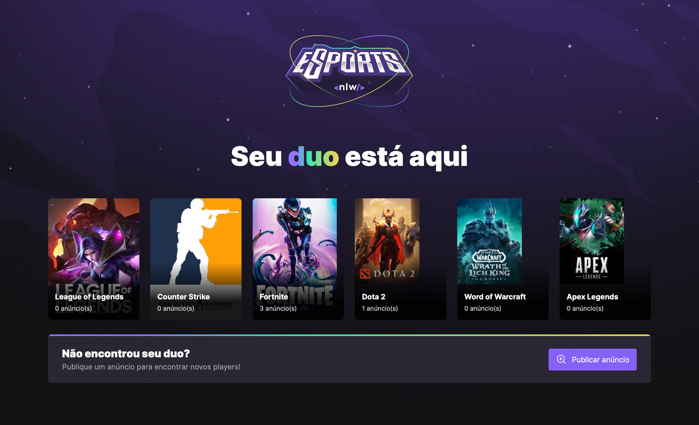

<div align="center">
  <h1>eSports</h1>
   
</div>

<h3 align="center">  
  <p align="center">
    <a href="#-sobre">Sobre</a>&nbsp;&nbsp;&nbsp;|&nbsp;&nbsp;&nbsp;
    <a href="#-tecnologias">Tecnologias</a>&nbsp;&nbsp;&nbsp;|&nbsp;&nbsp;&nbsp;
    <a href="#-como-executar">Como Executar</a>&nbsp;&nbsp;&nbsp;|&nbsp;&nbsp;&nbsp;
    <a href="#-licença">Licença</a>
  </p>
</h3>

## 📚 Sobre

O projeto eSports consiste em uma plataforma de jogos.

## 🚀 Tecnologias utilizadas:

- ReactJS
- Tailwind
- Libs: Radix e Phosphor
- Axios
- PostCSS

## ⏱ Como executar

```bash
# Clonar o repositório
$ git clone https://github.com/polyanetuag/NLW9-esports.git
# Entrar na pasta
$ cd web

# Instalar as dependências
$ npm i

# Iniciar o servidor
$ npm run dev

# O servidor será inicializado em <http://localhost:3000>
```

## 📝 Licença

Esse projeto está sob a licença MIT.

---

Desenvolvido com 💜 por Polyane Tuag
